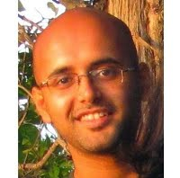

<html>

<body>
<!-- INTRODUCTION -->

<!-- PROFILE PICTURE -->

<!-- </img> -->

<h2> Sumanta Basu </h2> 
Assistant Professor   
Shayegani Bruno Family Faculty Fellow  
<a href="http://stat.cornell.edu/"> Department of Statistics and Data Science </a>  
<a href="https://bscb.cornell.edu/"> Department of Computational Biology </a>  
<a href="https://www.cornell.edu/"> Cornell University </a>  
Ithaca, NY    

[ <a href="papers.html"> Research </a> | <a href="teaching.html"> Teaching </a> | <a href="advising.html"> Advising </a>]

 
 

I am broadly interested in developing statistical machine learning methods for structure learning and prediction of complex, high-dimensional systems arising in biological and social sciences. I am currently working in two areas: (a) network modeling of high-dimensional time series; and (b) detecting high-order interactions in complex biological systems using randomized tree ensembles. I also work closely with scientists and economists on a wide range of problems including  prostate cancer progression, large scale metabolomics, and systemic risk monitoring in financial markets. 
<!-- Most of my papers are available on my <a href="https://scholar.google.com/citations?user=VCuHXdMAAAAJ&hl=en">Google Scholar</a> page. -->

My research is supported in part by a three-year grant from the National Science Foundation (NSF DMS-1812128), a four-year grant (1R01GM135926-01) from Joint DMS/NIGMS Initiative to Support Research at the Interface of the Biological and Mathematical Sciences  (DMS/NIGMS), and a two-year grant (1R21NS120227-01) from the National Institute of Health (NIH).

Before joining Cornell, I was a postdoctoral scholar (2014-2016) in the <a href="http://statistics.berkeley.edu/">Department of Statistics, UC Berkeley </a> and the <a href="http://biosciences.lbl.gov/"> Biosciences Division, Lawrence Berkeley National Laboratory </a>. I received my PhD (2014) from the <a href="http://lsa.umich.edu/stats/"> Department of Statistics, University of Michigan </a>, and my bachelors (2006) and masters (2008) in Statistics from <a href="http://www.isical.ac.in/"> Indian Statistical Institute, Kolkata </a>. Before joining the PhD program, I worked for a year as a business analyst at <a href="https://www.wipro.com/"> Wipro Technologies </a>.

<!--

Here is a link to my <a href="https://scholar.google.com/citations?user=VCuHXdMAAAAJ&hl=en"> Google Scholar profile </a> and my <a href="http://www.stat.berkeley.edu/~sumbose/drafts/CV_Basu_1127.pdf"> CV </a>. 

-->

<h2> Contact Information </h2>

Sumanta Basu  
1192 Comstock Hall  
Cornell University  
Ithaca, NY 14853  
Phone: (607) 255-9813  
email: <a href="mailto:sumbose@cornell.edu"> sumbose@cornell.edu
<!-- 

</body>
</html>
-->
